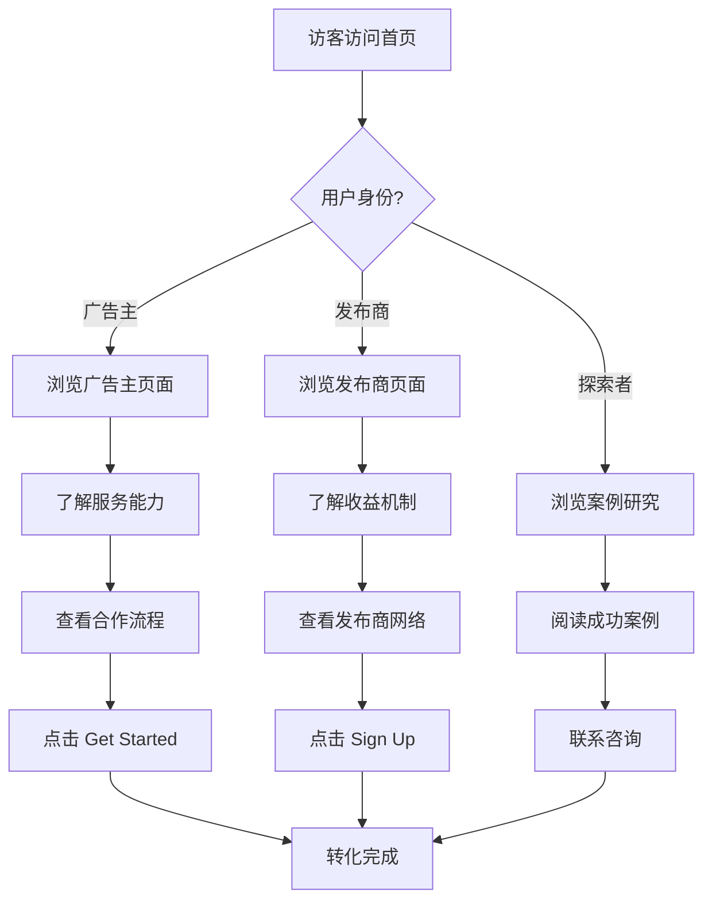

## 1. 产品概述

VSCommission 是一个面向英语系国家（美国、加拿大、英国、澳大利亚）的小型联盟营销平台官网，连接广告主（独立站商家和亚马逊商家）与多元化发布商（Coupon、Cashback、Influencer 等 10 种类型）。平台旨在通过透明的佣金机制和全球品牌合作网络，帮助商家实现可规模化的业绩增长，同时为发布商创造可持续的收入来源。

- **目标用户**：独立站商家、亚马逊商家、各类流量主/内容创作者
- **核心价值**：连接 100+ 全球品牌与 10 类专业发布商，提供透明高效的联盟营销解决方案
- **市场定位**：英语系国家的专业联盟营销网络平台

## 2. 核心功能

### 2.1 用户角色

| 角色 | 核心场景 |
|------|----------|
| 广告主 (Advertiser) | 注册入驻、浏览发布商网络、查看案例、了解平台能力 |
| 发布商 (Publisher) | 注册加入、了解佣金机制、选择品牌合作、学习增长策略 |
| 普通访客 | 了解平台、阅读案例研究、获取行业洞察 |

### 2.2 功能模块（页面清单）

1. **首页 (/)**：Hero 区、平台数据、服务概览、品牌展示墙、案例精选、发布商类型展示、CTA 区
2. **广告主页面 (/advertisers)**：广告主价值主张、服务能力、合作流程、定价模式
3. **广告主工作流程 (/advertisers/how-it-works)**：详细入驻流程、技术对接说明
4. **发布商页面 (/publishers)**：发布商价值主张、收益机制、成长路径
5. **发布商网络 (/publishers/network)**：10 种发布商类型详细介绍、匹配逻辑
6. **案例研究 (/case-studies)**：成功案例列表、详细案例展示
7. **品牌合作 (/brands)**：合作品牌展示墙、品牌分类（独立站/亚马逊）
8. **关于我们 (/about)**：公司故事、使命愿景、团队、数据成就
9. **行业洞察 (/insights)**：文章列表、行业趋势内容
10. **联系我们 (/contact)**：联系表单、办公地点、常见问题

### 2.3 页面详情

| 页面名称 | 模块名称 | 功能描述 |
|-----------|-------------|---------------------|
| 首页 | Hero 区 | 全屏视觉冲击，核心标语 "Trusted to Perform"，双 CTA 按钮 |
| 首页 | 平台数据 | 滚动数字动画展示：100+ 品牌、10K+ 发布商、$50M+ 年佣金等 |
| 首页 | 服务概览 | 平台三大核心能力卡片展示 |
| 首页 | 品牌展示墙 | 合作品牌 Logo 轮播展示 |
| 首页 | 案例精选 | 3 个精选案例卡片 |
| 首页 | 发布商类型 | 10 种发布商类型网格展示 |
| 首页 | CTA 区 | 双路径引导：广告主/发布商 |
| 广告主页 | 价值主张 | 标题 + 核心价值描述 |
| 广告主页 | 服务能力 | 6 个能力卡片（精准匹配、反欺诈、数据分析等） |
| 广告主页 | 合作流程 | 4 步流程图展示 |
| 广告主页 | 定价模式 | 佣金模式说明表格 |
| 发布商页 | 价值主张 | 标题 + 收益机制说明 |
| 发布商页 | 收益展示 | 佣金计算器/收益对比 |
| 发布商页 | 成长路径 | 发布商等级体系展示 |
| 发布商网络 | 类型展示 | 10 种发布商类型详细卡片 |
| 发布商网络 | 匹配逻辑 | 品牌-发布商智能匹配说明 |
| 案例研究 | 案例列表 | 可筛选案例网格 |
| 案例研究 | 案例详情 | 数据成果、策略说明 |
| 品牌合作 | 品牌墙 | 分类展示所有合作品牌 |
| 关于我们 | 公司故事 | 品牌故事时间线 |
| 关于我们 | 数据成就 | 关键数字展示 |
| 联系我们 | 联系表单 | 多字段表单提交 |
| 联系我们 | 常见问题 | FAQ 手风琴组件 |

## 3. 核心流程

用户访问网站后的主要转化路径：

## 4. 用户界面设计

### 4.1 设计风格

- **主色调**：深蓝 (#0A2540) 作为主品牌色，传达专业与信任感；活力橙 (#FF6B35) 作为强调色，代表增长与活力
- **辅助色**：浅灰 (#F8F9FA) 背景、白色卡片、深灰文字 (#1A1A2E)
- **按钮风格**：圆角按钮（8px），主按钮为橙色实心，次按钮为蓝色描边
- **字体方案**：标题使用 "Plus Jakarta Sans"（现代几何感），正文使用 "Inter"（清晰易读）
- **布局风格**：顶部固定导航 + 大幅 Hero 区 + 卡片式内容模块 + 宽幅 Footer
- **图标风格**：线性图标，2px 描边，圆润现代

### 4.2 页面设计概览

| 页面名称 | 模块名称 | UI 元素 |
|-----------|-------------|-------------|
| 首页 | Hero 区 | 全屏深蓝渐变背景，白色大标题，双 CTA 按钮，右侧抽象几何图形 |
| 首页 | 数据展示 | 白色背景，大号数字，滚动触发计数动画 |
| 首页 | 品牌墙 | 灰色背景，Logo 灰度悬停变色 |
| 首页 | 发布商类型 | 卡片网格，图标 + 标题 + 描述 |
| 广告主页 | 服务能力 | 白色卡片，图标 + 标题 + 描述，悬停上浮效果 |
| 发布商网络 | 类型展示 | 彩色渐变卡片，大图标 + 详细说明 |
| 案例研究 | 案例卡片 | 图片 + 标签 + 标题 + 摘要 + 阅读链接 |
| 全局 | 导航栏 | 深蓝背景，白色文字，下拉菜单 |
| 全局 | Footer | 深蓝背景，多列链接，社交图标 |

### 4.3 响应式设计

- **桌面优先**：1440px 设计基准，1280px 断点适配
- **平板适配**：768px-1024px，导航简化为汉堡菜单
- **移动端**：375px 基准，单列布局，触摸优化按钮（最小 44px）

### 4.4 视觉特色

- **渐变应用**：Hero 区使用深蓝到深紫的对角渐变，营造科技感
- **几何装饰**：抽象几何图形点缀，增强现代感
- **数据可视化**：关键数字使用大号字体 + 渐变色强调
- **微交互**：卡片悬停上浮、按钮按压反馈、滚动渐入动画
- **品牌一致性**：所有页面统一的头部导航和底部 Footer
