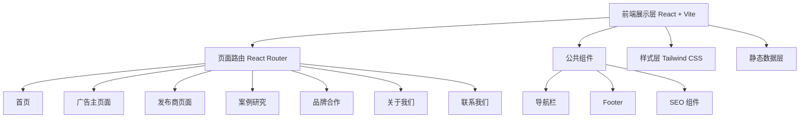

## 1. 架构设计



## 2. 技术选型

- **前端框架**：React@18 + Vite
- **样式方案**：Tailwind CSS@3
- **路由方案**：React Router DOM@6
- **图标库**：Lucide React（线性图标）
- **动画库**：Framer Motion（滚动动画、微交互）
- **初始化工具**：Vite React 模板
- **后端**：无（纯静态官网，表单提交使用模拟交互）
- **数据来源**：本地静态数据（品牌列表、案例数据、发布商类型等）

## 3. 路由定义

| 路由路径 | 页面名称 | 主要内容 |
|---------|---------|---------|
| / | 首页 | Hero、数据、服务、品牌墙、案例、发布商类型、CTA |
| /advertisers | 广告主页面 | 价值主张、服务能力、合作流程、定价模式 |
| /advertisers/how-it-works | 广告主工作流程 | 详细入驻流程、技术对接 |
| /publishers | 发布商页面 | 价值主张、收益机制、成长路径 |
| /publishers/network | 发布商网络 | 10 种发布商类型详细介绍 |
| /case-studies | 案例研究 | 案例列表、筛选 |
| /case-studies/:id | 案例详情 | 单个案例详细展示 |
| /brands | 品牌合作 | 品牌展示墙、分类 |
| /about | 关于我们 | 公司故事、使命、数据 |
| /insights | 行业洞察 | 文章列表 |
| /contact | 联系我们 | 联系表单、FAQ |

## 4. 组件结构

```
src/
├── components/
│   ├── layout/
│   │   ├── Navbar.jsx          # 顶部导航栏（含下拉菜单）
│   │   ├── Footer.jsx          # 底部 Footer
│   │   └── Layout.jsx          # 页面布局包裹器
│   ├── home/
│   │   ├── Hero.jsx            # Hero 区
│   │   ├── StatsBar.jsx        # 数据展示条
│   │   ├── PlatformOverview.jsx # 平台概览
│   │   ├── BrandWall.jsx       # 品牌展示墙
│   │   ├── CaseHighlights.jsx  # 案例精选
│   │   ├── PublisherTypes.jsx  # 发布商类型
│   │   └── CTASection.jsx      # CTA 区
│   ├── common/
│   │   ├── SectionTitle.jsx    # 通用区块标题
│   │   ├── Card.jsx            # 通用卡片
│   │   ├── Button.jsx          # 通用按钮
│   │   └── ScrollReveal.jsx    # 滚动动画包裹器
│   └── seo/
│       └── SEO.jsx             # SEO Meta 标签管理
├── pages/
│   ├── Home.jsx
│   ├── Advertisers.jsx
│   ├── AdvertisersHowItWorks.jsx
│   ├── Publishers.jsx
│   ├── PublishersNetwork.jsx
│   ├── CaseStudies.jsx
│   ├── CaseStudyDetail.jsx
│   ├── Brands.jsx
│   ├── About.jsx
│   ├── Insights.jsx
│   └── Contact.jsx
├── data/
│   ├── brands.js               # 品牌数据
│   ├── caseStudies.js          # 案例数据
│   ├── publisherTypes.js       # 发布商类型数据
│   ├── stats.js                # 平台数据
│   └── insights.js             # 文章数据
├── App.jsx                     # 路由配置
└── index.css                   # 全局样式 + Tailwind
```

## 5. SEO 策略

- **Meta 标签**：每个页面独立的 title、description、keywords
- **Open Graph**：社交分享卡片标签
- **结构化数据**：Organization、WebSite Schema 标记
- **Sitemap**：生成 sitemap.xml 便于搜索引擎收录
- **语义化 HTML**：使用 header、nav、main、section、footer 等语义标签
- **面包屑导航**：子页面包含面包屑
- **图片优化**：使用 WebP 格式，包含 alt 属性

## 6. 数据模型

### 6.1 品牌数据

```javascript
{
  name: "Anker",
  category: "Electronics",        // 行业分类
  type: "independent",            // independent | amazon
  logo: "/images/brands/anker.svg",
  description: "...",
  commissionRate: "Up to 8%",
  cookieDuration: "30 days"
}
```

### 6.2 发布商类型数据

```javascript
{
  type: "Coupon",
  icon: "Ticket",
  title: "Coupon Sites",
  description: "...",
  avgEarning: "$2,500/month",
  bestFor: ["Retail brands", "Consumer goods"]
}
```

### 6.3 案例研究数据

```javascript
{
  id: "anker-global-expansion",
  brand: "Anker",
  category: "Electronics",
  title: "...",
  summary: "...",
  results: { revenue: "+320%", conversionRate: "4.8%" },
  image: "/images/cases/anker.jpg"
}
```
